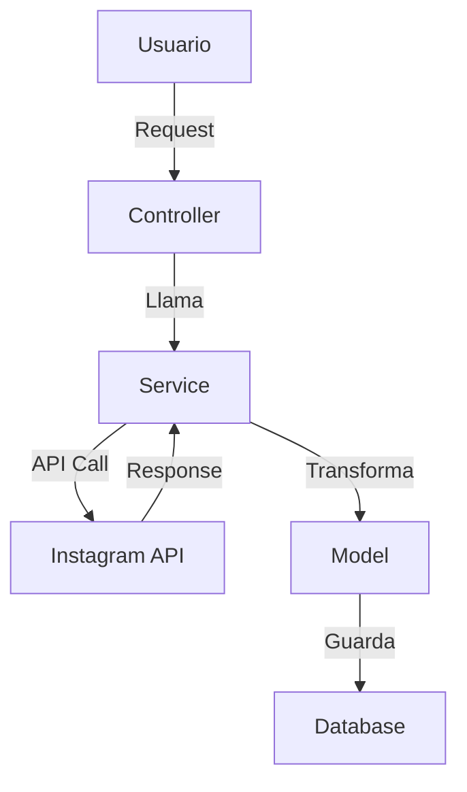

# Guía de Documentación para Aplicaciones Rails

## Índice

1. [Filosofía de Documentación](#filosofía-de-documentación)
2. [Estructura de Documentación](#estructura-de-documentación)
3. [Documentación por Capas](#documentación-por-capas)
4. [Herramientas y Formatos](#herramientas-y-formatos)
5. [Mejores Prácticas](#mejores-prácticas)
6. [Checklist de Documentación](#checklist-de-documentación)

---

## Filosofía de Documentación

### Principios Fundamentales

1. **Documenta el "por qué", no solo el "qué"**
   - Explica decisiones de diseño y trade-offs
   - Documenta contexto histórico cuando sea relevante
   - Incluye referencias a issues/PRs relacionados

2. **Mantén la documentación cerca del código**
   - README en la raíz para overview general
   - Comentarios inline para lógica compleja
   - Archivos de documentación en carpetas relevantes

3. **Documenta para diferentes audiencias**
   - Nuevos desarrolladores del equipo
   - Mantenimiento futuro (tu yo del futuro)
   - Stakeholders técnicos y no técnicos

4. **La documentación es código**
   - Revisa cambios en documentación en PRs
   - Mantén la documentación actualizada con el código
   - Usa herramientas de validación cuando sea posible

---

## Estructura de Documentación

### Estructura Recomendada

```
rails-app/
├── README.md                          # Overview general del proyecto
├── DOCUMENTATION_GUIDE.md            # Esta guía
├── ARCHITECTURE.md                    # Arquitectura general
├── API_DOCUMENTATION.md               # Documentación de APIs públicas
├── DEPLOYMENT.md                      # Guía de deployment
├── DEVELOPMENT.md                     # Guía para desarrolladores
├── CONTRIBUTING.md                    # Guía de contribución
│
├── docs/                              # Documentación adicional
│   ├── database/
│   │   ├── schema_design.md           # Diseño de schema
│   │   └── migrations_guide.md       # Guía de migraciones
│   ├── services/
│   │   ├── instagram_integration.md   # Integración específica
│   │   └── tiktok_integration.md     # Integración específica
│   ├── workflows/
│   │   ├── data_sync.md               # Flujos de sincronización
│   │   └── background_jobs.md        # Jobs y tareas
│   └── troubleshooting/
│       └── common_issues.md           # Problemas comunes
│
├── .github/
│   └── copilot-instructions.md       # Instrucciones para AI assistants
│
└── app/
    ├── models/
    │   └── README.md                  # Documentación de modelos
    ├── services/
    │   └── README.md                  # Documentación de servicios
    └── controllers/
        └── README.md                  # Documentación de controladores
```

---

## Documentación por Capas

### 1. README.md (Raíz del Proyecto)

**Propósito**: Primera impresión del proyecto. Debe responder:
- ¿Qué hace esta aplicación?
- ¿Cómo la ejecuto?
- ¿Cómo contribuyo?

**Estructura Recomendada**:

```markdown
# Nombre del Proyecto

## Descripción
Breve descripción (2-3 párrafos) de qué hace la aplicación y para quién.

## Características Principales
- Lista de características principales
- Con enlaces a documentación detallada cuando sea relevante

## Requisitos Previos
- Ruby X.X.X
- Rails X.X.X
- PostgreSQL X.X
- Redis (para background jobs)
- Node.js X.X (si usa frontend assets)

## Instalación Rápida

### 1. Clonar el repositorio
```bash
git clone [repo-url]
cd [project-name]
```

### 2. Instalar dependencias
```bash
bundle install
yarn install  # si aplica
```

### 3. Configurar base de datos
```bash
rails db:create
rails db:migrate
rails db:seed  # si hay seeds
```

### 4. Configurar variables de entorno
```bash
cp .env.example .env
# Editar .env con tus valores
```

### 5. Iniciar servidor
```bash
rails server
# o
bin/dev  # si usa Procfile.dev
```

## Estructura del Proyecto
Breve descripción de las carpetas principales y su propósito.

## Documentación Adicional
- [Guía de Desarrollo](DEVELOPMENT.md)
- [Arquitectura](ARCHITECTURE.md)
- [API Documentation](API_DOCUMENTATION.md)
- [Deployment](DEPLOYMENT.md)

## Contribuir
Ver [CONTRIBUTING.md](CONTRIBUTING.md)

## Licencia
[Tu licencia]
```

### 2. ARCHITECTURE.md

**Propósito**: Documentar decisiones arquitectónicas y estructura general.

**Contenido**:

```markdown
# Arquitectura de la Aplicación

## Visión General
Diagrama o descripción de alto nivel de la arquitectura.

## Stack Tecnológico
- **Framework**: Rails X.X
- **Base de Datos**: PostgreSQL X.X
- **Cache**: Redis
- **Background Jobs**: Sidekiq/DelayedJob
- **Frontend**: [Framework usado]
- **Testing**: RSpec/Minitest

## Patrones Arquitectónicos

### Service Objects
- Ubicación: `app/services/`
- Propósito: Lógica de negocio compleja
- Convenciones: [explicar convenciones]

### Query Objects
- Ubicación: `app/queries/`
- Propósito: Consultas complejas reutilizables

### Form Objects
- Ubicación: `app/forms/`
- Propósito: Validación y transformación de datos

### Policy Objects
- Ubicación: `app/policies/`
- Propósito: Autorización

## Estructura de Datos

### Modelos Principales
- `Profile` - Perfiles de Instagram
- `TiktokProfile` - Perfiles de TikTok
- `InstagramPost` - Posts de Instagram
- `TiktokPost` - Posts de TikTok

### Relaciones Clave
[Diagrama o descripción de relaciones]

## Integraciones Externas

### APIs de Terceros
- Instagram (via Scrape.do)
- TikTok (via tikAPI.io)
- [Otras integraciones]

### Servicios Externos
- ActiveStorage (S3/Local)
- [Otros servicios]

## Flujos de Datos Principales

### Sincronización de Perfiles
1. [Paso 1]
2. [Paso 2]
3. [Paso 3]

### Procesamiento de Posts
[Descripción del flujo]

## Decisiones Arquitectónicas Importantes

### ADR-001: Uso de Service Objects
**Contexto**: [Por qué se tomó esta decisión]
**Decisión**: [Qué se decidió]
**Consecuencias**: [Impacto positivo y negativo]

### ADR-002: [Otra decisión]
[Similar estructura]
```

### 3. DEVELOPMENT.md

**Propósito**: Guía completa para desarrolladores trabajando en el proyecto.

**Contenido**:

```markdown
# Guía de Desarrollo

## Configuración del Entorno

### Variables de Entorno Requeridas
```bash
# Base de datos
DATABASE_URL=postgresql://...

# APIs Externas
INSTAGRAM_SCRAPE_DO_TOKEN=...
TIKTOK_API_KEY=...

# ActiveStorage
AWS_ACCESS_KEY_ID=...
AWS_SECRET_ACCESS_KEY=...
AWS_REGION=...
AWS_BUCKET=...
```

### Configuración Local
[Pasos específicos para setup local]

## Convenciones de Código

### Naming Conventions
- Modelos: Singular, PascalCase (`Profile`, `InstagramPost`)
- Servicios: `Namespace::ServiceName` (`InstagramServices::GetProfileData`)
- Controladores: Plural, PascalCase (`ProfilesController`)
- Helpers: Snake_case (`storage_helper.rb`)

### Estructura de Archivos
[Convenciones específicas del proyecto]

## Testing

### Ejecutar Tests
```bash
# Todos los tests
rspec

# Tests específicos
rspec spec/models/profile_spec.rb

# Con coverage
COVERAGE=true rspec
```

### Escribir Tests
[Guías y ejemplos]

## Flujos de Trabajo Comunes

### Agregar un Nuevo Modelo
1. Generar migración
2. Crear modelo con validaciones
3. Agregar tests
4. Documentar en README de models/

### Agregar un Nuevo Servicio
1. Crear en namespace apropiado
2. Heredar de ApplicationService
3. Implementar método `call`
4. Agregar tests
5. Documentar en README de services/

## Debugging

### Logs
- Desarrollo: `log/development.log`
- Producción: [Cómo acceder]

### Debugging Tools
- `binding.pry` / `debugger`
- Rails console: `rails console`
- [Otras herramientas]

## Git Workflow

### Branching Strategy
- `main` - Producción
- `develop` - Desarrollo
- `feature/*` - Nuevas features
- `fix/*` - Bug fixes

### Commit Messages
[Convenciones de commits]

### Pull Requests
[Proceso de PRs]
```

### 4. API_DOCUMENTATION.md

**Propósito**: Documentar APIs públicas (si las hay).

**Contenido**:

```markdown
# API Documentation

## Base URL
```
https://api.example.com/api/v1
```

## Autenticación
[Descripción del método de autenticación]

## Endpoints

### GET /profiles/search
Buscar perfiles de Instagram.

**Query Parameters**:
- `q` (string, required): Término de búsqueda
- `page` (integer, optional): Número de página

**Response**:
```json
{
  "profiles": [...],
  "meta": {
    "page": 1,
    "total_pages": 10
  }
}
```

### GET /profiles/:username
Obtener perfil específico.

[Similar estructura para cada endpoint]
```

### 5. DEPLOYMENT.md

**Propósito**: Guía de deployment y operaciones.

**Contenido**:

```markdown
# Guía de Deployment

## Entornos

### Desarrollo
- URL: http://localhost:3000
- Base de datos: PostgreSQL local
- [Otras configuraciones]

### Staging
- URL: https://staging.example.com
- Base de datos: [Detalles]
- [Otras configuraciones]

### Producción
- URL: https://example.com
- Base de datos: [Detalles]
- [Otras configuraciones]

## Proceso de Deployment

### Pre-deployment Checklist
- [ ] Tests pasando
- [ ] Migraciones revisadas
- [ ] Variables de entorno actualizadas
- [ ] Backup de base de datos

### Deployment Steps
1. [Paso 1]
2. [Paso 2]
3. [Paso 3]

### Post-deployment
- [ ] Verificar logs
- [ ] Ejecutar smoke tests
- [ ] Monitorear métricas

## Rollback
[Proceso de rollback]

## Monitoreo
[Herramientas y métricas]
```

### 6. Documentación de Modelos

**Ubicación**: `app/models/README.md`

```markdown
# Modelos

## Profile (Instagram)
**Tabla**: `profiles`

### Propósito
Almacena información de perfiles de Instagram.

### Campos Principales
- `username` (string, unique): Nombre de usuario de Instagram
- `uid` (string): ID único de Instagram
- `followers` (integer): Número de seguidores
- `data` (jsonb): Payload completo de la API

### Relaciones
- `has_many :instagram_posts`
- `has_one_attached :avatar`

### Scopes Importantes
- `enabled`: Perfiles habilitados
- `paraguayos`: Perfiles de Paraguay
- `tracked`: Perfiles rastreados (enabled + paraguayos + micro)

### Métodos Clave
- `update_profile`: Actualiza datos desde API
- `save_avatar`: Descarga y guarda avatar

### Ejemplo de Uso
```ruby
profile = Profile.enabled.paraguayos.first
profile.update_profile
profile.save_avatar
```

## [Otros modelos...]
```

### 7. Documentación de Servicios

**Ubicación**: `app/services/README.md`

```markdown
# Servicios

## Convenciones

Todos los servicios heredan de `ApplicationService` y deben:
- Implementar método `call`
- Retornar objeto con `success?` y `data`/`error`
- Manejar errores apropiadamente

## InstagramServices

### InstagramServices::GetProfileData
Obtiene datos de perfil desde Instagram API.

**Uso**:
```ruby
result = InstagramServices::GetProfileData.call('username')
if result.success?
  data = result.data
else
  error = result.error
end
```

**Parámetros**:
- `username` (string, required): Username de Instagram

**Retorna**:
- `success?` (boolean): Si la operación fue exitosa
- `data` (Hash): Datos del perfil (si success)
- `error` (String): Mensaje de error (si falló)

**Errores Posibles**:
- `InvalidUsernameError`: Username inválido
- `APIError`: Error de API
- `TimeoutError`: Timeout en request

## [Otros servicios...]
```

### 8. Comentarios en Código

**Cuándo comentar**:
- Lógica compleja que no es obvia
- Workarounds temporales (con TODO y fecha)
- Decisiones de negocio importantes
- Algoritmos no triviales

**Ejemplo**:

```ruby
# Calcula el alcance estimado usando método híbrido
# Combina cálculos basados en followers e interacciones
# Ver: https://github.com/org/repo/issues/123
def estimated_reach
  # Método 1: Basado en followers (15% engagement promedio)
  follower_based_reach = followers * 0.15
  
  # Método 2: Basado en interacciones
  # Asumimos que 10% de interacciones = reach único
  interaction_based_reach = total_interactions_count * 10
  
  # Promedio ponderado (60% followers, 40% interactions)
  weighted_reach = (follower_based_reach * 0.6) + (interaction_based_reach * 0.4)
  
  # Cap máximo: nunca más del 50% de followers
  max_reach = followers * 0.5
  
  [weighted_reach, max_reach].min.round
end
```

---

## Herramientas y Formatos

### Formatos Recomendados

1. **Markdown** (.md)
   - README, guías generales
   - Fácil de leer en GitHub/GitLab
   - Renderizado automático

2. **YARD** (Ruby)
   - Documentación de código Ruby
   - Genera HTML automáticamente
   - Integración con IDEs

3. **Swagger/OpenAPI** (APIs)
   - Documentación de APIs REST
   - Genera UI interactiva
   - Validación automática

### Herramientas Útiles

- **YARD**: Documentación de código Ruby
- **RDoc**: Alternativa a YARD
- **Swagger UI**: Documentación de APIs
- **Draw.io/Mermaid**: Diagramas
- **Postman**: Documentación de APIs con ejemplos

---

## Mejores Prácticas

### 1. Mantén la Documentación Actualizada

- Incluye cambios de documentación en PRs
- Revisa documentación en code reviews
- Actualiza cuando cambies código relacionado

### 2. Usa Ejemplos Reales

```ruby
# ❌ Malo
# Usa este método para obtener datos

# ✅ Bueno
# Obtiene datos de perfil desde Instagram API
# Ejemplo:
#   result = InstagramServices::GetProfileData.call('username')
#   if result.success?
#     profile.update_from_api_data(result.data)
#   end
```

### 3. Documenta Edge Cases

```ruby
# Maneja el caso donde el usuario puede no tener avatar
# En este caso, usa un placeholder
def avatar_url
  avatar.attached? ? direct_blob_url(avatar) : placeholder_url
end
```

### 4. Incluye Diagramas Cuando Sea Útil



### 5. Documenta Decisiones (ADR)

**Architecture Decision Records (ADR)**

Crea archivos en `docs/adr/` para decisiones importantes:

```markdown
# ADR-001: Uso de Service Objects para lógica de negocio

## Status
Aceptado

## Contexto
Necesitábamos separar lógica de negocio de controladores y modelos...

## Decisión
Usaremos Service Objects siguiendo el patrón ApplicationService...

## Consecuencias
**Positivas**:
- Código más testeable
- Separación de responsabilidades

**Negativas**:
- Más archivos que mantener
- Curva de aprendizaje para nuevos desarrolladores
```

---

## Checklist de Documentación

### Para Nuevos Features

- [ ] README actualizado con nueva feature
- [ ] Documentación en ARCHITECTURE.md si cambia arquitectura
- [ ] Documentación de modelos en `app/models/README.md`
- [ ] Documentación de servicios en `app/services/README.md`
- [ ] Comentarios inline para lógica compleja
- [ ] Ejemplos de uso en documentación
- [ ] ADR creado si es decisión arquitectónica importante
- [ ] Guía de desarrollo actualizada si cambia workflow

### Para Nuevas Integraciones

- [ ] Documentación completa en `docs/services/[integration].md`
- [ ] Variables de entorno documentadas
- [ ] Ejemplos de uso
- [ ] Manejo de errores documentado
- [ ] Rate limits y limitaciones documentadas

### Para Nuevos Modelos

- [ ] Propósito del modelo
- [ ] Campos principales explicados
- [ ] Relaciones documentadas
- [ ] Scopes importantes
- [ ] Métodos clave con ejemplos
- [ ] Validaciones importantes

### Para Nuevos Servicios

- [ ] Propósito del servicio
- [ ] Parámetros de entrada
- [ ] Valores de retorno
- [ ] Errores posibles
- [ ] Ejemplos de uso
- [ ] Dependencias externas

---

## Conclusión

La documentación efectiva:
- ✅ Facilita onboarding de nuevos desarrolladores
- ✅ Reduce tiempo de debugging
- ✅ Preserva conocimiento del equipo
- ✅ Facilita mantenimiento a largo plazo
- ✅ Mejora calidad del código

**Recuerda**: La mejor documentación es código claro y bien estructurado. La documentación escrita complementa, no reemplaza, código bien escrito.

